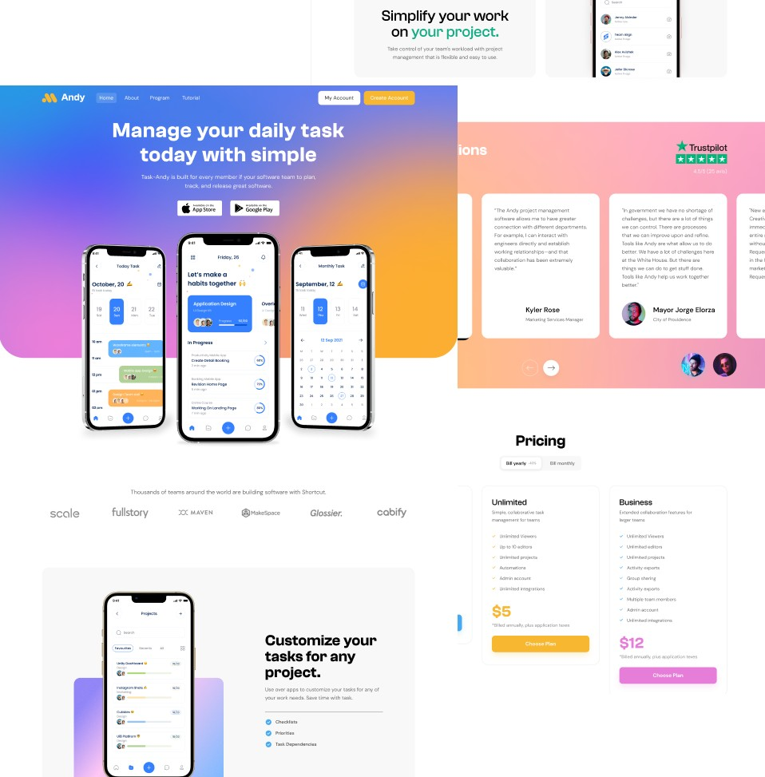

# Andy Landing Page

## Bienvenido! 👋

Esta landing page la realicé a partir de un diseño realizado en Figma.

Dicho diseño lo obtuve de manera gratuita en la página de [Uihut](https://uihut.com/)

## Características 📄

- Sitio realizado con la metodología "Mobile First".
- Sitio adaptable a diferentes tamaños de pantalla (responsive web design).
- Aplicación de la metodología BEM (Block, Element, Modifier).
- Uso de la librería [Swiperjs](https://swiperjs.com/) para el slider.
- Uso de [Ionicons](https://ionic.io/ionicons) para algunos iconos.
<!-- - Mejora en el performance del sitio gracias al uso de imagenes .webp (no incluidas en los archivos suministrados por [Frontend Mentor](https://www.frontendmentor.io)) y el uso de la librería modernizr.js. -->

<!--  -->

## Despliegue 📦

Te invito a conocer el sitio desplegado en las siguientes plataformas:

- Github Pages: https://faridleo1998.github.io/Andy/

## Construido con 🛠️

Para la creación del sitio se usaron las siguientes tecnologías y herramientas:

- Tecnologías:

    
    
    
    

- Herramientas (Gratis):
    - [Visual Studio Code](https://code.visualstudio.com/) --> Editor de texto.
    - [Responsively App](https://responsively.app/) --> Visualizar el sitio en distintos tamaños de pantalla.

## Autor (es) ✒️

Este sitio fue realizado por:

* **Farid Moreno** - [Faridleo1998](https://github.com/Faridleo1998)

<!-- También puedes mirar la lista de todos los [contribuyentes](https://github.com/your/project/contributors) quíenes han participado en este proyecto. 
 -->

## Agradecimientos 🎁

* Gracias por visitar este repositorio, es para mi un honor compartir y demostrar mis habilidades con otras personas.🤓
* Deja una ⭐ si te ha gustado esta landing page y te invito a que descubras mis otros repositorios 🚀
<!-- * Invita una cerveza 🍺 o un café ☕ a alguien del equipo. 
* etc. -->